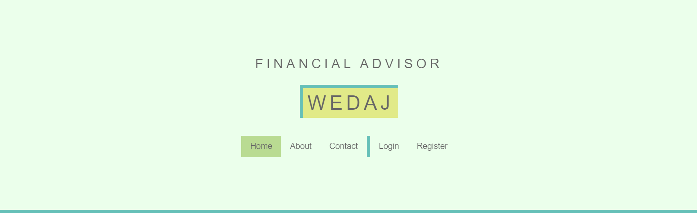

# WEDAJ



WEDAJ is a website that provides financial advice and guidance.
The name "wedaj" means "friend" or "helper" in Amharic, and that is exactly what we aim to be for you.
We want to be your friend and helper in your journey to financial well-being.
Wedaj is your one-stop shop for everything you need to improve your finances.
Whether you are a beginner or a seasoned pro, we have something to help you.
Visit our website today and start your journey to financial well-being!
The frontend is developed using our native adwa.css, pure HTML, and JavaScript.

The Backend is developed using the Python Django framework.

We use simple algorithm that can decide by calculating the given values and giving the main advice that the helps the user.

## Installation

Before you can run this project, you need to have Python and Django installed on your system.

### 1. Install Python

If you don't have Python installed, follow these steps to get it:

- Visit the official Python website: [python.org](https://www.python.org/downloads/)
- Download the latest Python version for your operating system.
- Run the installer and follow the installation instructions.

### 2. Install Django

Once you have Python installed, you can install Django using `pip`, Python's package manager. Open your terminal or command prompt and enter the following command:

```bash
pip install django

## Project Setup Instructions

If you have Python and Django installed, you can get started with this project by following these steps:

## Clone the Project Repository

Use the following command to clone the project repository and navigate to the project directory:

git clone https://github.com/bayushkibret/WEDAJ-for-A2SV-hackathon.git
cd your-project
python manage.py runserver


